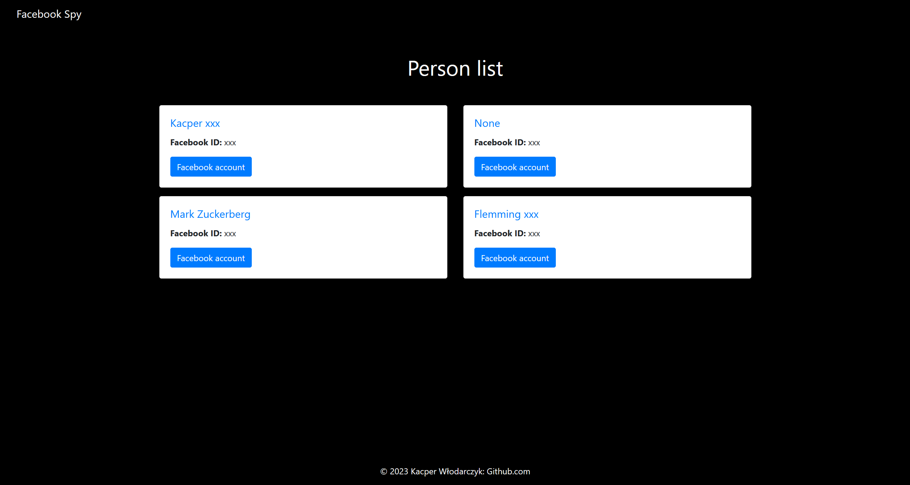
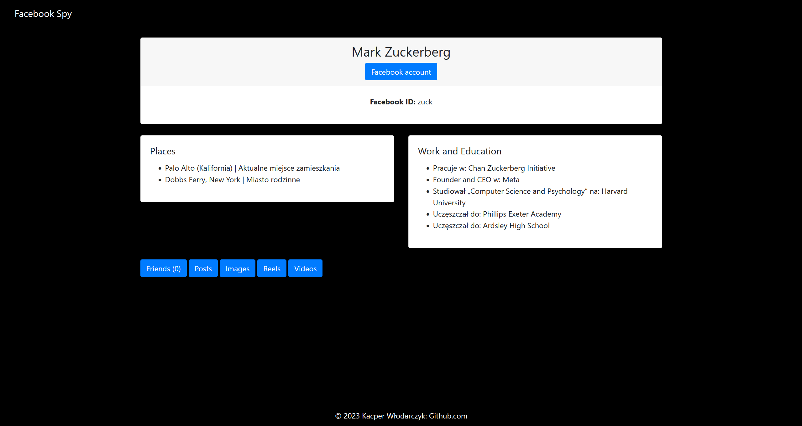
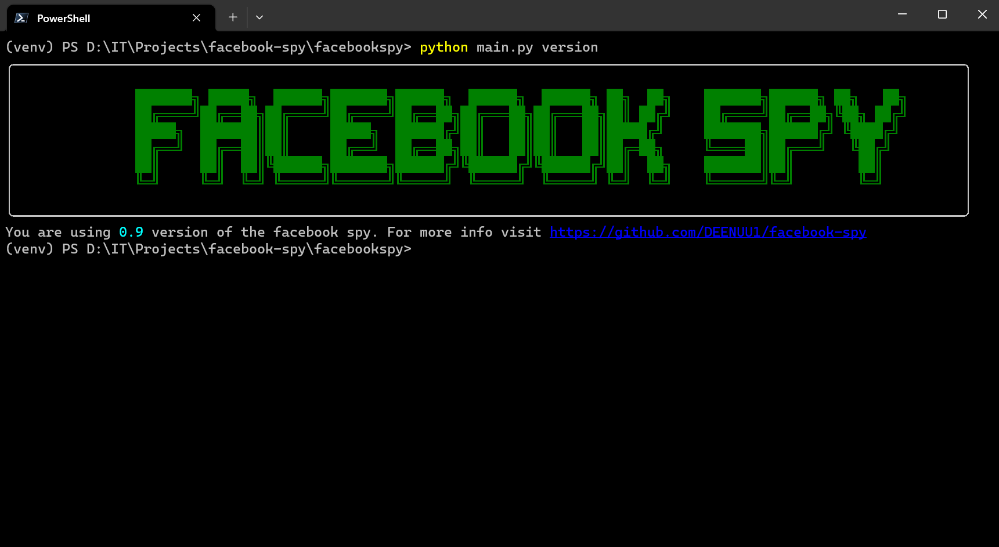
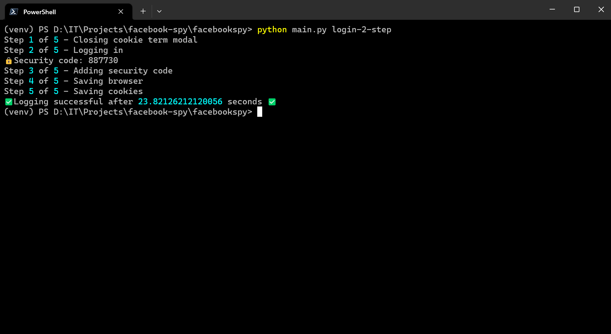
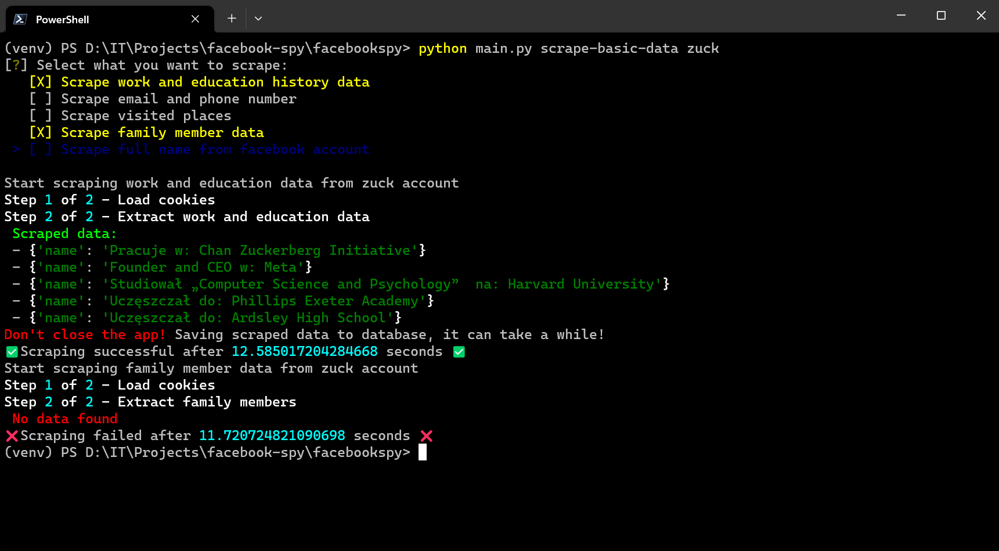
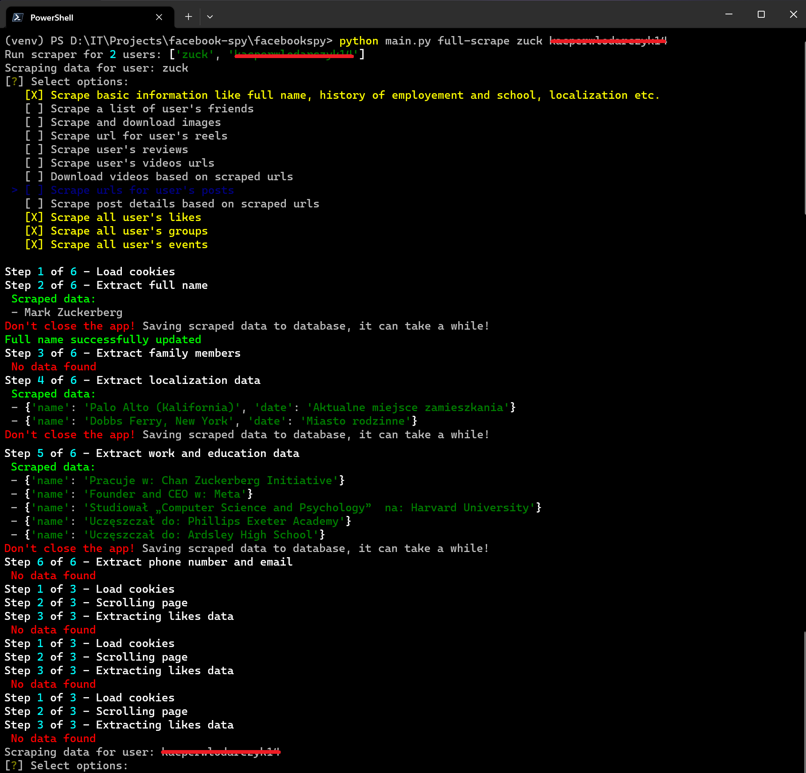
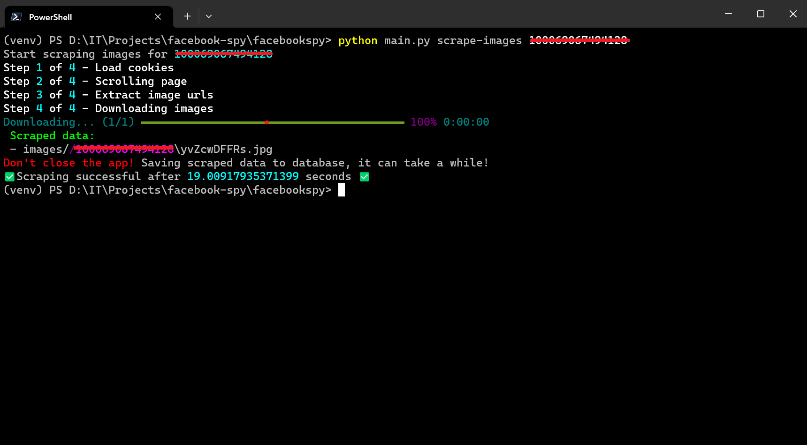
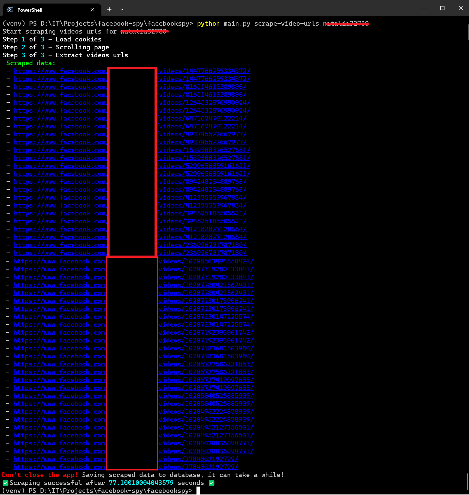
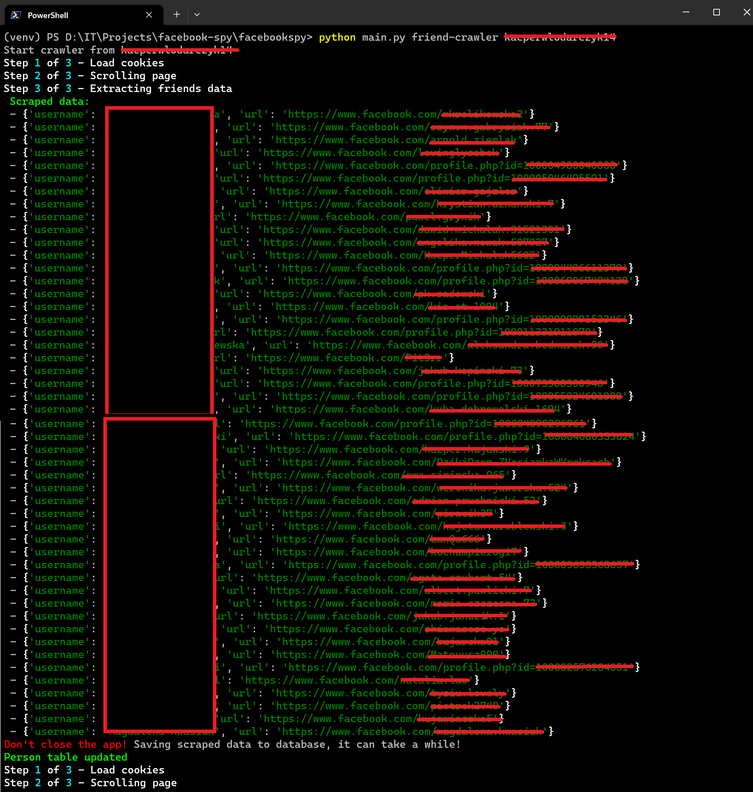
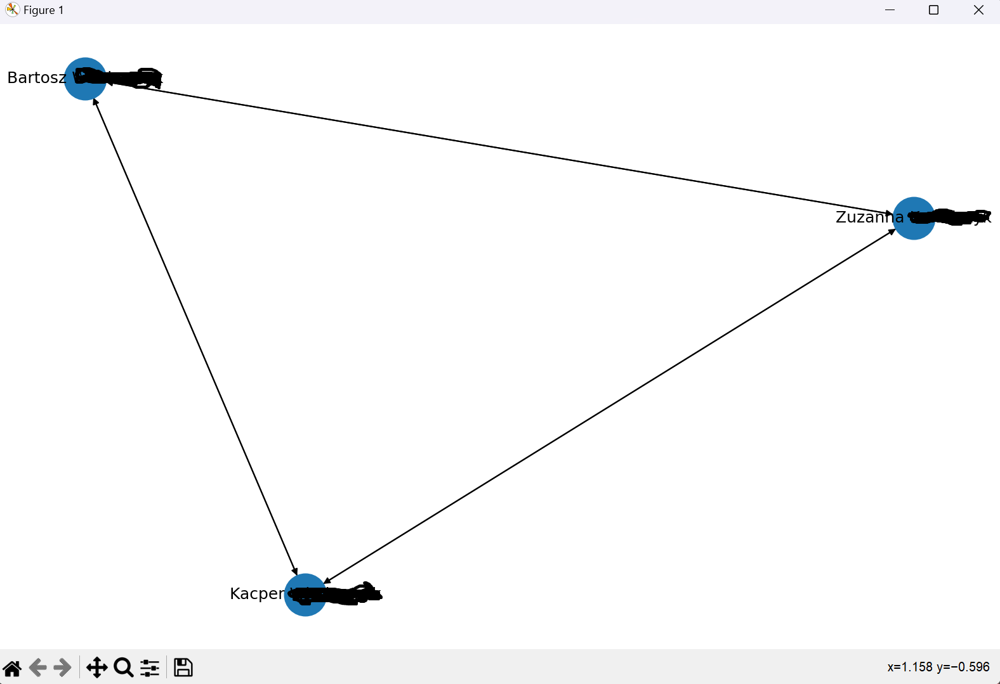

<a name="readme-top"></a>


[![Contributors][contributors-shield]][contributors-url]
[![Forks][forks-shield]][forks-url]
[![Stargazers][stars-shield]][stars-url]
[![Issues][issues-shield]][issues-url]
[![MIT License][license-shield]][license-url]
[![LinkedIn][linkedin-shield]][linkedin-url]


<br />
<div align="center">

  <h3 align="center">Facebook Spy</h3>

  <p align="center">
    Facebook Spy is a versatile Python-based tool designed to scrape various data from Facebook profiles, pages and search results. Whether you need basic information or want to delve deep into a user's activity, Facebook Spy has you covered. 
    <br />
    <br />
    <a href="https://github.com/DEENUU1/facebook-spy/issues">Report Bug</a>
    ·
    <a href="https://github.com/DEENUU1/facebook-spy/issues">Request Feature</a>
  </p>
  
  
  
  
  
</div>


<h2><a href="https://deenuu1.github.io/facebook-spy/">Documentation is available here</a></h2>


## Info

If you're using a Facebook account with a custom ID in the URL (e.g., https://www.facebook.com/zuck), Facebook Spy will work smoothly. However, for accounts with default IDs in the URL, certain scrapers may not function as expected. These include scrapers for work and education, contact data, visited places, family members, recent places, reviews, and likes. Rest assured, we're actively working to resolve this issue

<!-- ABOUT THE PROJECT -->
## About The Project

The project, known as "Facebook Spy," is a powerful and versatile tool designed to gather information from Facebook profiles, pages and search results. 

The project is under constant development to improve its functionality and address any issues that may arise.

One notable limitation of the tool is that some scrapers may not work correctly for profiles with default account IDs in the URL, such as "https://www.facebook.com/profile.php?id=100063142210972." These scrapers include work and education history, contact data, visited places, family members, recent places, reviews, and likes. However, this issue does not occur for profiles with custom IDs in the URL, like "https://www.facebook.com/zuck.".


## Key Features
- Login - Perform a secure two-step verification process to log in to Facebook account with enhanced security settings or log in to Facebook account using the default login method.
- Scrape details like: friend list, images, recent places, videos, reels, reviews, posts, likes, groups, events etc.
- Local web application - User is able to run a loval web application to browse scraped data, create notes for specified Person object and easly search details in web.
- Video downloader - download all scraped videos from facebook account or just by add passed url.
- Create a graphical representation of connections between different Facebook profiles based on their friendships.
- Utilize a free open-source language model to generate a concise summary of a Facebook user's infromation based on the scraped data.
- Initiate a friend crawler for a specified Facebook account. Gether data about friends and contunue the process for subsequent users in the queue.
- Save scraped data for a specified Facebook user to PDF file for documentation and anylysis.
- Running scrapers in parallel to speed up the data collection process
- Save all scraped data to JSON files and database 

### Built With

- Python
  - Typer 
  - FastAPI
  - Selenium
- SQLite 
- HTML / CSS / Bootstrap5

<!-- GETTING STARTED -->
## Getting Started


### Installation

1. Clone git repository
```bash
git clone https://github.com/DEENUU1/facebook-spy.git
```

2. Create dotenv file and add required data
```bash
cp .env_example .env
```

3. Install all requirements
```bash
pip install -r requirements.txt
```

4. Change directory to facebookspy to run commands
```bash
cd facebookspy
```

### Tests

To run pytests use this command
```bash
pytest
```


## Examples
This is just a few examples of how you can use this tool. For more comments check <a href="https://deenuu1.github.io/facebook-spy/commands/>">Documentation</a>

#### Version

```bash
python main.py version
```




#### Login

```bash
python main.py login-2-step
```

OR

```bash
python main.py login
```

  


#### Search
```bash
python main.py search < "Search query" > < number_of_results> 
```


#### Scrape basic data

```bash
python main.py scrape-basic-data <facebook_id>
```




#### Full scraping
This one works for multiply users
```bash
python main.py full-scrape <facebook_id> <facebook_id> ... <facebook_id>
```



#### Scrape images

```bash
python main.py scrape-images <facebook_id>
```




#### Scrape videos
After successfull scrape you are able to download this videos
```bash
python main.py scrape-video-urls <facebook_id>
```




#### Friend crawler
This command works similarly to the command that scrapes data about a given user's friends list. The difference, however, is that after scraping and creating Friend objects, it also creates objects for the CrawlerQueue model and after successfully scraping friends for one user, it proceeds to scraping the list of friends for the next user in the queue.
```bash
python main.py friend-crawler <facebook_id>
```




#### Graph
Graph of connections between Person objects based on ther friends.

```bash
python main.py graph
```



<!-- LICENSE -->
## License

See `LICENSE.txt` for more information.


<!-- MARKDOWN LINKS & IMAGES -->
<!-- https://www.markdownguide.org/basic-syntax/#reference-style-links -->
[contributors-shield]: https://img.shields.io/github/contributors/DEENUU1/facebook-spy.svg?style=for-the-badge
[contributors-url]: https://github.com/DEENUU1/facebook-spy/graphs/contributors
[forks-shield]: https://img.shields.io/github/forks/DEENUU1/facebook-spy.svg?style=for-the-badge
[forks-url]: https://github.com/DEENUU1/facebook-spy/network/members
[stars-shield]: https://img.shields.io/github/stars/DEENUU1/facebook-spy.svg?style=for-the-badge
[stars-url]: https://github.com/DEENUU1/facebook-spy/stargazers
[issues-shield]: https://img.shields.io/github/issues/DEENUU1/facebook-spy.svg?style=for-the-badge
[issues-url]: https://github.com/DEENUU1/facebook-spy/issues
[license-shield]: https://img.shields.io/github/license/DEENUU1/facebook-spy.svg?style=for-the-badge
[license-url]: https://github.com/DEENUU1/facebook-spy/blob/master/LICENSE.txt
[linkedin-shield]: https://img.shields.io/badge/-LinkedIn-black.svg?style=for-the-badge&logo=linkedin&colorB=555
[linkedin-url]: https://linkedin.com/in/kacper-wlodarczyk
[basic]: https://github.com/DEENUU1/facebook-spy/blob/main/assets/v1_2/basic.gif?raw=true
[full]: https://github.com/DEENUU1/facebook-spy/blob/main/assets/v1_2/full.gif?raw=true
[search]: https://github.com/DEENUU1/facebook-spy/blob/main/assets/v1_2/search.gif?raw=true