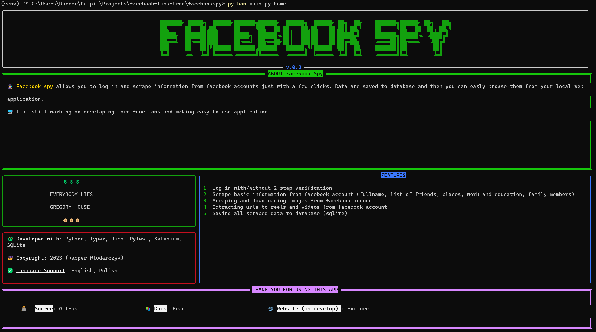
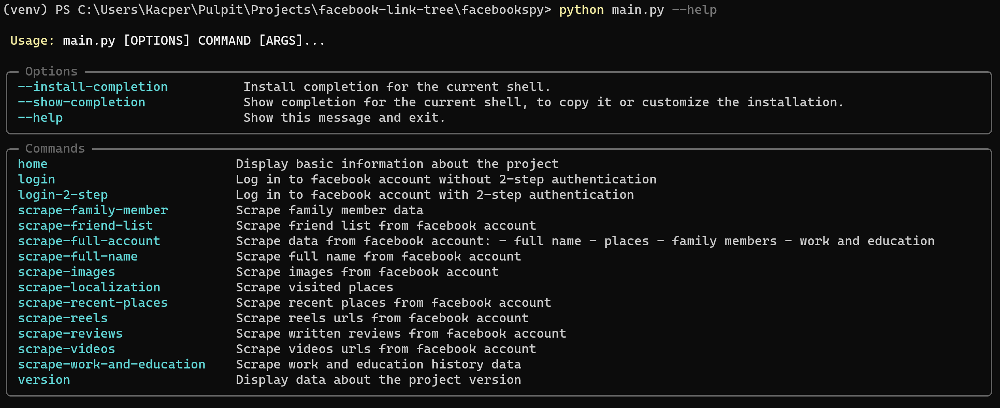
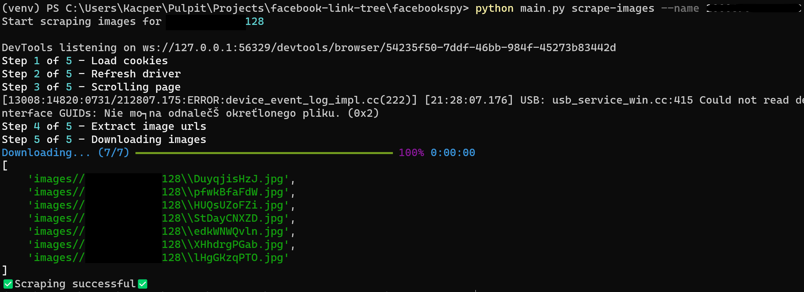
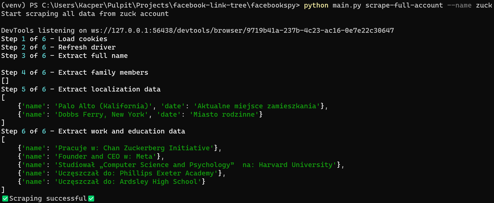

[![Stargazers][stars-shield]][stars-url]
[![Issues][issues-shield]][issues-url]
[![MIT License][license-shield]][license-url]
[![LinkedIn][linkedin-shield]][linkedin-url]

 

  <h3 align="center">Facebook Spy</h3>

  

    Scrape user's profile on facebook using CLI app and browse data using local web app.
     
     
    <a href="https://github.com/DEENUU1/facebook-spy/issues">Report Bug</a>
    ·
    <a href="https://github.com/DEENUU1/facebook-spy/issues">Request Feature</a>
  

  

https://github.com/DEENUU1/facebook-spy/assets/111304236/19032a83-a0f0-4834-9d2c-cb89e504673a

<h2><a href="https://deenuu1.github.io/facebook-spy/">Documentation is available here</a></h2>

<!-- ABOUT THE PROJECT -->
## About The Project
This project allows to log in using selenium to facebook account (even if you have 2-step verification), 
scrape user information based on a given url address and save data to database and local files.
After that you can browse scraped data, add notes, search more detail in google using local web application.

### Built With
- Python
  - Typer
  - Selenium
- FastAPI 
- React
  - Vite 
- Sqlite
- Docker & docker compose 

## Key Features
- Log in with 2-step verification
- Log in without 2-step verification
- Save cookies to save log in session
- Scrape information like:
  - work and education
  - places
  - full name
  - recent places 
  - videos
    - download videos
  - reels
  - list of friends
  - images
    - download images
  - reviews
- Save scraped data to database
- Local web app (FastAPI + React):
  - Browse scraped data
  - Adding notes in local web app for specified person
  - Automatically search scraped data in google

## Screenshots

 

<!-- LICENSE -->
## License

Distributed under the Apache-2.0 license. See `LICENSE.txt` for more information.

## Author

- [@DEENUU1](https://www.github.com/DEENUU1)

<!-- MARKDOWN LINKS & IMAGES -->
<!-- https://www.markdownguide.org/basic-syntax/#reference-style-links -->
[contributors-shield]: https://img.shields.io/github/contributors/DEENUU1/facebook-spy.svg?style=for-the-badge
[contributors-url]: https://github.com/DEENUU1/facebook-spy/graphs/contributors
[forks-shield]: https://img.shields.io/github/forks/DEENUU1/facebook-spy.svg?style=for-the-badge
[forks-url]: https://github.com/DEENUU1/facebook-spy/network/members
[stars-shield]: https://img.shields.io/github/stars/DEENUU1/facebook-spy.svg?style=for-the-badge
[stars-url]: https://github.com/DEENUU1/facebook-spy/stargazers
[issues-shield]: https://img.shields.io/github/issues/DEENUU1/facebook-spy.svg?style=for-the-badge
[issues-url]: https://github.com/DEENUU1/facebook-spy/issues
[license-shield]: https://img.shields.io/github/license/DEENUU1/facebook-spy.svg?style=for-the-badge
[license-url]: https://github.com/DEENUU1/facebook-link-tree/blob/main/LICENSE
[linkedin-shield]: https://img.shields.io/badge/-LinkedIn-black.svg?style=for-the-badge&logo=linkedin&colorB=555
[linkedin-url]: https://www.linkedin.com/in/kacper-wlodarczyk/
