[![Stargazers][stars-shield]][stars-url]
[![Issues][issues-shield]][issues-url]
[![MIT License][license-shield]][license-url]
[![LinkedIn][linkedin-shield]][linkedin-url]


<br />
<div align="center">
  <a href="https://github.com/DEENUU1/">
    
  </a>

  <h3 align="center">Facebook link tree</h3>

  <p align="center">
    Scrape user's profile on facebook.
    <br />
    <br />
    <a href="https://github.com/DEENUU1/OLX-Analytics/issues">Report Bug</a>
    ·
    <a href="https://github.com/DEENUU1/OLX-Analytics/issues">Request Feature</a>
  </p>
</div>


<!-- TABLE OF CONTENTS -->

### Table of Contents
  <ol>
    <li>
      <a href="#about-the-project">About The Project</a>
      <ul>
        <li><a href="#built-with">Built With</a></li>
      </ul>
    </li>
    <li><a href="#key-features">Key features</a></li>
    <li><a href="#version">Version history and future</a></li>
    <li><a href="#screenshots">Screenshots</a></li>
    <li>
      <a href="#getting-started">Getting Started</a>
      <ul>
        <li><a href="#installation">Installation</a></li>
        <li><a href="#configuration">Configuration</a></li>
        <li><a href="#commands">Commands</a></li>
      </ul>
    </li>
    <li><a href="#unit-tests">Tests</a></li>
    <li><a href="#acknowledgments">Acknowledgments</a></li>
    <li><a href="#license">License</a></li>
    <li><a href="#author">Author</a></li>
  </ol>

<!-- ABOUT THE PROJECT -->
## About The Project
<p style="color: red">This project is still in develop. I will regularly publish new versions, you can follow the progress in the issue.</p>

This project allows to log in using selenium to facebook account (even if you have 2-step verification), 
scrape user information based on a given url address and save data to database and local files.


### Built With
- Python
- Typer
- Selenium
- Sqlite

## Key Features
- Log in with 2-step verification
- Log in without 2-step verification
- Save cookies to save log in session
- Scrape a list of friends
- Scrape information like:
  - work and education
  - places
  - full name
  - recent places 


## Screenshots

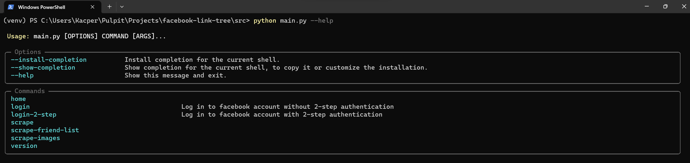
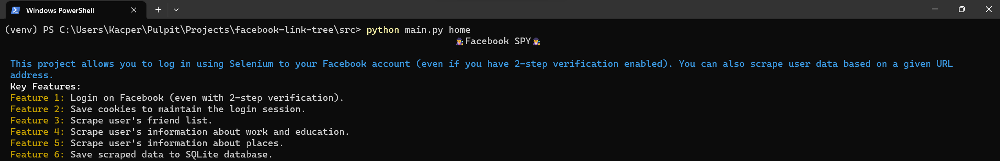
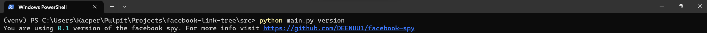
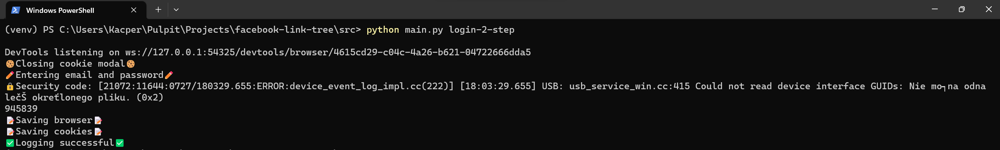
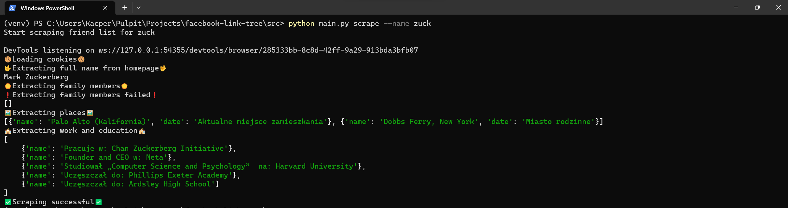
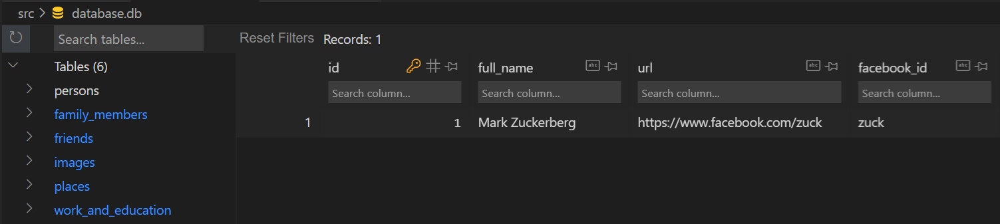
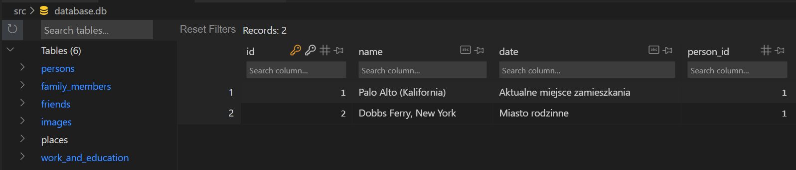
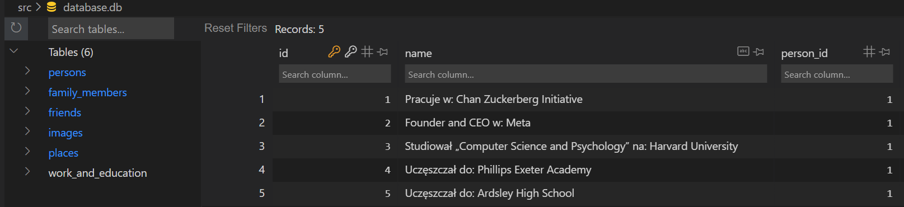

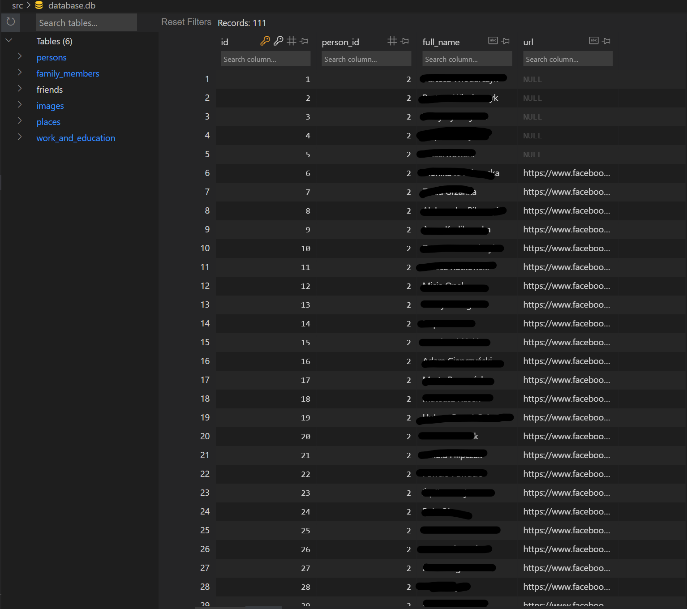
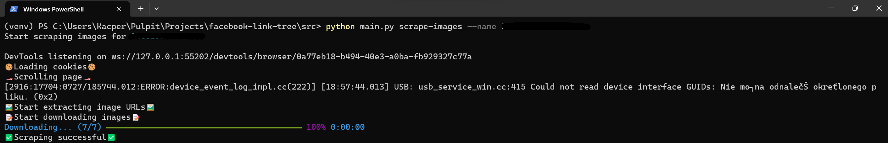
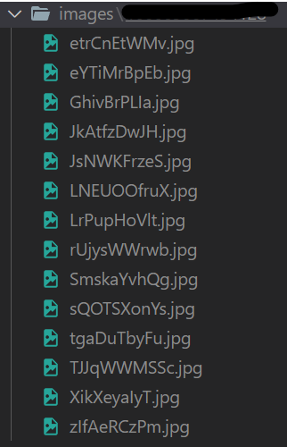
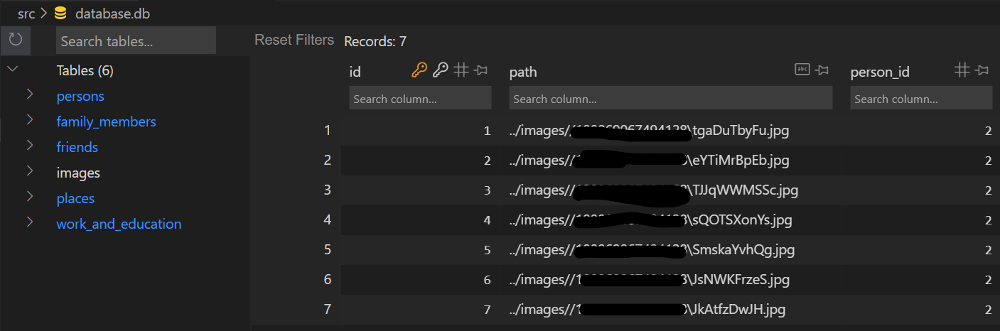

## Version
### v0.1
- Login system and saving cookies 
- Scrape:
  - user's friend list
  - user's info about work and education
  - user's info about places
  - full name 
- save scraped data to database

### v0.2
- Scrape
  - recent places
  - reels
  - videos
  - reviews
  
### v0.3 (in develop)
- Save scraped data from v0.2 to database 
- Create elastic pipelines to add more interaction with user and more functions

### v0.4 (ideas)
- Fastapi to return data from database 
- Local server 

### v0.5 (ideas)
- React frontend for local server 

### v0.6 (ideas)
- Scrape:
  - groups
  - music
  - sport
  - movies
  - tv
  - books
  - likes
  - contact data and basic info

<!-- GETTING STARTED -->
## Getting Started

### Installation

First, you need to clone this repository
```bash
git clone https://github.com/DEENUU1/facebook-link-tree.git
```

### Configuration
1. Create dotenv file and add required data 
```bash
cp .env_example .env 
````
2. Then install all requirements
```bash
pip install -r requirements.txt
```
3. Change directory to src and run first command
```bash
# If you have 2-step verification run

python main.py login-2-step

# If you don't have 2-step verification run

python main.py login
```
4. Run command to scrape user's friends list
```bash
python main.py --name <user_id>
```


### Commands
```bash
python main.py --help 
# Returns a list of all commands

python main.py home
# Display a home page with information about the application

python main.py version
# Display current version of the app

python main.py login-2-step
# Allows to log in on facebook account with 2-step verification

pyton main.py login
# Allows to log in on facebook account without 2-step verification

python main.py scrape --name <facebook_id>
# Allows to scrape data like: full name, work and education, places

python main.py scrape-friend-list --name <facebook_id>
# Allows to scrape all friends 

python main.py scrape-images --name <facebook_id>
# Allows to scrape all images and save them locally
```

<!-- LICENSE -->
## License

Distributed under the Apache-2.0 license. See `LICENSE.txt` for more information.


## Author

- [@DEENUU1](https://www.github.com/DEENUU1)


<!-- MARKDOWN LINKS & IMAGES -->
<!-- https://www.markdownguide.org/basic-syntax/#reference-style-links -->
[contributors-shield]: https://img.shields.io/github/contributors/DEENUU1/facebook-spy.svg?style=for-the-badge
[contributors-url]: https://github.com/DEENUU1/facebook-spy/graphs/contributors
[forks-shield]: https://img.shields.io/github/forks/DEENUU1/facebook-spy.svg?style=for-the-badge
[forks-url]: https://github.com/DEENUU1/facebook-spy/network/members
[stars-shield]: https://img.shields.io/github/stars/DEENUU1/facebook-spy.svg?style=for-the-badge
[stars-url]: https://github.com/DEENUU1/facebook-spy/stargazers
[issues-shield]: https://img.shields.io/github/issues/DEENUU1/facebook-spy.svg?style=for-the-badge
[issues-url]: https://github.com/DEENUU1/facebook-spy/issues
[license-shield]: https://img.shields.io/github/license/DEENUU1/facebook-spy.svg?style=for-the-badge
[license-url]: https://github.com/DEENUU1/facebook-link-tree/blob/main/LICENSE
[linkedin-shield]: https://img.shields.io/badge/-LinkedIn-black.svg?style=for-the-badge&logo=linkedin&colorB=555
[linkedin-url]: https://www.linkedin.com/in/kacper-wlodarczyk/
